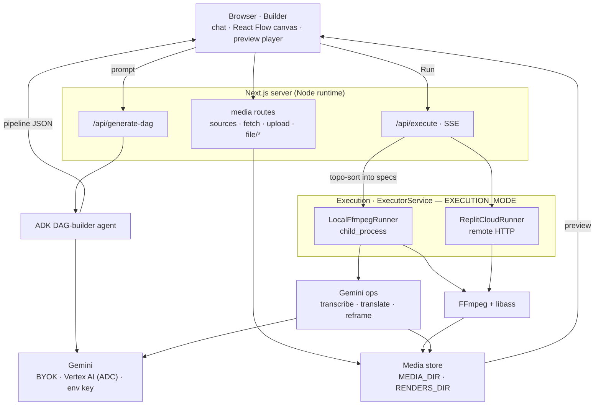

# 🎬 CineDAG — Build & run multimodal video pipelines

> **Agentic Cinema Hackathon · Replit Partner Track** · repo: `video-pipeline-agent`

**▶️ Live app: [cinedag.replit.app](https://cinedag.replit.app/)** · **🎬 Demo video: [youtu.be/tg5KCGneYFc](https://youtu.be/tg5KCGneYFc)**

Editing video for social — subtitles, translations, vertical reframes — normally
means wrestling with a timeline editor or hand-written FFmpeg commands. CineDAG
removes that: describe a video workflow in plain English and a **Gemini-powered
multi-agent pipeline** builds and runs it — AI dubbing, bilingual subtitle
burning, social-media aspect-ratio crops, highlight reels, and more.

Powered by the **Google Agent Development Kit (ADK) for TypeScript**
(`@google/adk`) + Gemini, with a pluggable execution engine that runs FFmpeg
**locally** for fast dev or **inside a Replit Repl** in production.

---

## Architecture

<!-- Diagram source: docs/architecture.mmd (keep this block in sync with it). -->



- **Browser · Builder** — chat, the React Flow canvas, and the preview player;
  sends prompts and Run requests.
- **Next.js API** — `/api/generate-dag` (plan), `/api/execute` (run, streamed live
  over SSE), and media routes (list sources, paste-URL fetch, upload, range-served
  files).
- **ADK builder agent** — turns a prompt into a **Resource/Operation DAG** (JSON)
  with Gemini; a follow-up chat refines the same graph in place instead of
  starting over.
- **Executor** — runs each step behind one interface, selected by `EXECUTION_MODE`:
  - `local` — **`LocalFfmpegRunner`** runs FFmpeg via `child_process` on this
    machine, or **inside the Repl** on the deployed app.
  - `replit` — **`ReplitCloudRunner`** offloads each FFmpeg step to a remote Replit
    executor over HTTP, then pulls outputs back.
  - Same graph either way — swap engines with one env var, no app code changes.
- **Gemini** — plans the pipeline and runs the multimodal steps (transcribe,
  translate, reframe); reached via a BYOK key, Vertex AI (ADC), or an env key.
- **FFmpeg (+ libass)** — the deterministic media work: subtitle burn, vertical
  reframe, transcode.
- **Media store** — staged sources + rendered outputs on disk, served back to the
  browser via `/api/file/*`.

The generated graph **strictly alternates** between two node families:

| Node          | Meaning                       | Examples                                   |
| ------------- | ----------------------------- | ------------------------------------------ |
| **Resource**  | a concrete media artifact     | `raw.mp4`, `audio.wav`, `subs.en.srt`      |
| **Operation** | an ADK agent / tool that runs | `Audio Extractor`, `Transcriber`, `Burner` |

Every path looks like `resource → operation → resource → operation → …`.

## Getting started

**Use the live app** — [cinedag.replit.app](https://cinedag.replit.app/). It runs
on Replit with Gemini served through **Vertex AI**; nothing to install. (You can
also paste your own Gemini key in **Settings**.)

**Or run it locally:**

```bash
pnpm install
cp .env.example .env.local     # set one Gemini backend (below)
pnpm dev                       # http://localhost:3000
```

FFmpeg must be on your `PATH` (or set `FFMPEG_PATH`); burning subtitles needs
**libass** (`brew install ffmpeg-full`).

**Gemini access — pick any one** (resolved per request, in this priority order):

1. **BYOK** — paste a key in the app's **Settings**; sent per request, kept only in
   your browser.
2. **Vertex AI** — set `GOOGLE_GENAI_USE_VERTEXAI=true` + `GOOGLE_CLOUD_PROJECT`;
   auth via ADC (`gcloud auth application-default login` locally, or a
   service-account key on Replit).
3. **Gemini API key** — set `GEMINI_API_KEY` (or `GOOGLE_API_KEY`) in `.env.local`.

With none set, the app falls back to a canned sample pipeline so the UI still demos.

## Configuration (`.env.local`)

| Var                         | Default            | Purpose                                                |
| --------------------------- | ------------------ | ------------------------------------------------------ |
| `GEMINI_API_KEY`            | —                  | Gemini key for the ADK (`GOOGLE_API_KEY` also accepted) |
| `GOOGLE_GENAI_USE_VERTEXAI` | `false`            | `true` → use Vertex AI (ADC) instead of a key          |
| `GOOGLE_CLOUD_PROJECT`      | —                  | GCP project (required for Vertex AI)                   |
| `GEMINI_MODEL`              | `gemini-3.5-flash` | Model backing the agent                                |
| `EXECUTION_MODE`            | `local`            | `local` (FFmpeg here / in-Repl) or `replit` (remote)   |
| `MEDIA_DIR`                 | `./public/media`   | Staged sources (paste-link + uploads)                  |
| `RENDERS_DIR`               | `./public/renders` | Per-run working dir + outputs                          |
| `MAX_UPLOAD_MB`             | `100`              | Cap for pasted-link fetches + uploads                  |
| `FFMPEG_PATH`               | `ffmpeg`           | FFmpeg binary path                                     |

## Load a video + preview results

- **Load** a source three ways (left panel → *Source video*): a bundled **sample**
  clip, a **pasted URL** (fetched server-side, never through the browser), or an
  **upload**. Links/uploads are capped by `MAX_UPLOAD_MB`.
- **Run** the pipeline — FFmpeg steps execute for real, and the Gemini transcriber
  produces real `.srt` subtitles (editable in the Results pane before re-running).
- **Preview** any resource node in the **Results** pane — a video player for video
  nodes, an editable subtitle view for subtitle nodes; download the final video
  from the player menu. Generated files live in `/public/renders` and are served
  via `/api/file/*`.

## Tech stack

- **Next.js** (App Router, Node runtime) · **React 19** · **Tailwind CSS**
- **React Flow** (`@xyflow/react`) + **dagre** for the pipeline canvas
- **Google ADK** (`@google/adk`) driving **Gemini** (Gemini API / Vertex AI)
- **FFmpeg** (+ **libass**) via `child_process` locally · remote executor on Replit

## Hackathon — Replit Partner Track

Built for the **Agentic Cinema Hackathon · Replit Partner Track**. CineDAG uses
Google Cloud and Replit **at runtime, on every request** — not just at build time:

| Requirement                    | How CineDAG meets it                                                                                             |
| ------------------------------ | --------------------------------------------------------------------------------------------------------------- |
| Built with **Replit Agent**    | Imported from GitHub and iterated on with Replit Agent                                                           |
| **Deployed on Replit**         | Live on a Reserved VM at [cinedag.replit.app](https://cinedag.replit.app/)                                       |
| **Google Cloud at runtime**    | Every prompt calls **Gemini** (via **Gemini API** or **Vertex AI**) to plan the pipeline, then again to transcribe, translate, and analyze reframing |
| **Partner service at runtime** | **FFmpeg executes inside the Repl** — build, run, and preview all happen on Replit                              |
