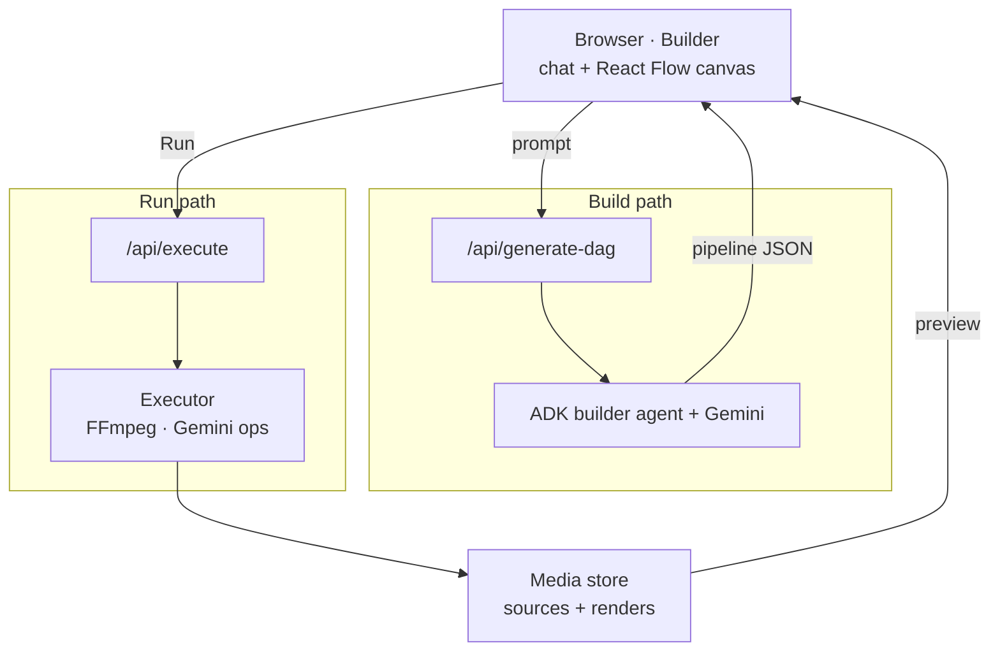
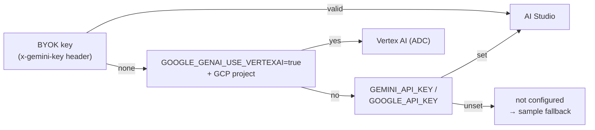
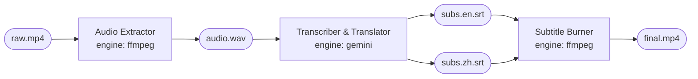
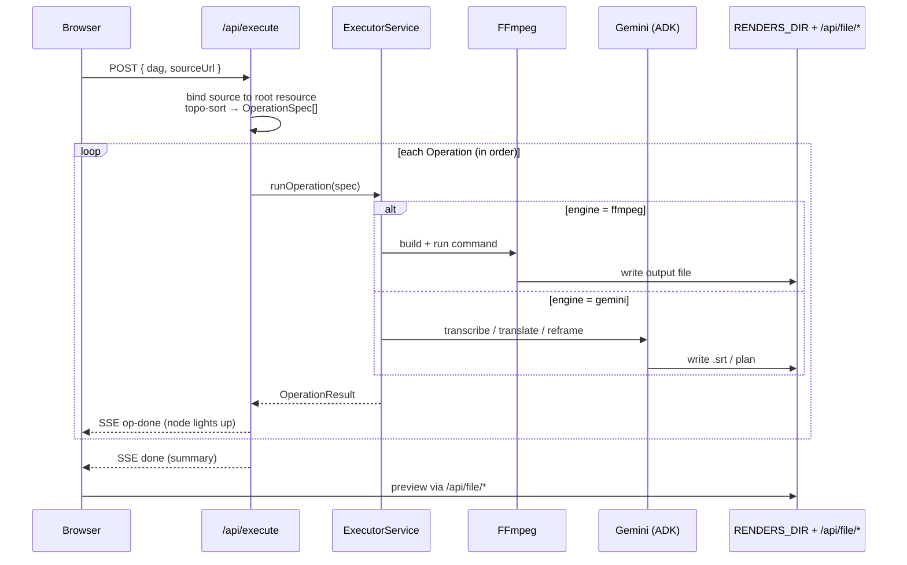

# CineDAG — Architecture

CineDAG turns a plain-English request into a **Resource/Operation DAG** that a
Gemini-driven agent builds and an executor runs on FFmpeg. There are two
end-to-end paths: **Build** (prompt → pipeline JSON) and **Run** (pipeline →
rendered artifacts). Both share one browser client and one Next.js API layer.

## System overview

Two lanes flow down from the browser: **Build** (left) turns a prompt into a
pipeline; **Run** (right) executes it. Both read and write the same media store.

Media I/O (list sources, paste-URL fetch, upload, range-served preview) all go
through the **Media store**; the diagram folds those routes into one box.
The **Executor** picks FFmpeg-local or Replit-cloud from `EXECUTION_MODE` — see
[Run path](#run-path--pipeline--artifacts) below.

## Build path — prompt → pipeline

The client posts the prompt (and, on a follow-up, the current pipeline to
**refine in place**) to `/api/generate-dag`. An ADK `LlmAgent` calls Gemini and
returns a validated Resource/Operation DAG; the canvas renders it. With no key
configured, the route returns a canned sample so the UI is always demoable.

**Backend resolution** (`keyContext.resolveModelConfig()`) picks a Gemini
backend per request, in priority order:

## The DAG — strictly alternating nodes

Every generated pipeline alternates two node families; a path is always
`Resource → Operation → Resource → …`. Operations carry an `engine`
(`ffmpeg` | `gemini` | `tts`) that decides where they run.

- **Resource** — a concrete media artifact (`raw.mp4`, `audio.wav`, `subs.zh.srt`).
- **Operation** — an agent/tool step (`ffmpeg` transform, `gemini` multimodal, `tts`).

## Run path — pipeline → artifacts

`getExecutor()` picks the runner from `EXECUTION_MODE` behind a single
`ExecutorService` interface, so swapping engines needs no app changes:

- **`LocalFfmpegRunner`** — runs `ffmpeg` ops via `child_process`; `gemini` ops
  run real transcription / translation / reframe analysis through the ADK (need a
  Gemini key, skip cleanly without one); `tts` is stubbed.
- **`ReplitCloudRunner`** — offloads FFmpeg steps to a small executor service on
  Replit over HTTP (upload → exec → download); Gemini calls still run locally.

## Deploying the whole app on Replit

For the Partner Track, the entire Next.js app runs on Replit with
`EXECUTION_MODE=local`, so FFmpeg executes **inside the Repl** — no separate
executor. See [`REPLIT_DEPLOY.md`](REPLIT_DEPLOY.md).
